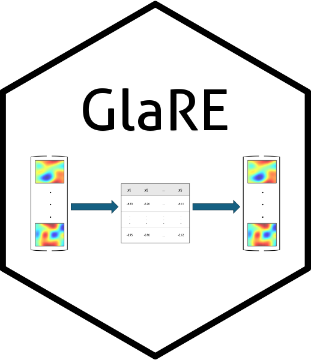

<!-- README.md is generated from README.Rmd. Please edit that file -->

```{r, include = FALSE}
knitr::opts_chunk$set(
  collapse = TRUE,
  comment = "#>",
  fig.path = "man/figures/README-",
  out.width = "100%",
  fig.retina = 2
)
```

<!-- badges: start -->

<center>  </center>


<!-- badges: end -->

The goal of `GLaRE` is to facilitate the evaluation of losslessness of different latent feature representations based on generalisation error.

## Installation

You can install the development version of GLarE from [GitHub](https://github.com/) with:

``` r
# install.packages("devtools")
devtools::install_github("edwardgunning/GLaRe")
```

Load the `GLaRE` package.

```{r example}
library(GLarE)
```

Set random seed for both shuffling folds and stochastic optimisation of the autoencoder model.

```{r seed}
tensorflow::set_random_seed(1996)
```

## Example: Phenoeme Data

We use the Phenoeme dataset for this example (see [here](https://www.math.univ-toulouse.fr/~ferraty/SOFTWARES/NPFDA/)).

```{r, out.width = "50%", fig.asp=0.75, message=FALSE, warning=FALSE}
# Phoenome dataset:
PH_path <- "https://www.math.univ-toulouse.fr/~ferraty/SOFTWARES/NPFDA/npfda-phoneme.dat"
PH <- readr::read_table(file = PH_path, col_names = FALSE)
PH <- as.matrix(PH)[, 1:150]
par(mfrow = c(1, 1))
matplot(t(PH)[, sample(1:nrow(PH), size = 20)], type = "l", xlab = "Freq.", ylab = "Log-periodogram")
```

We look at the representation given by PCA, autoencoder and DWT.

```{r, fig.asp = 0.33}
# run GLaRe
par(mfrow = c(1, 3), cex = 0.5) # side-by-side plots

## PCA:
ph_pca <- GLaRe(
  mat = PH,
  learn = "pca",
  kf = 5,
  cvqlines = 0.9,
  cutoff_criterion = 0.95,
  tolerance_level = 0.05,
  latent_dim_by = 10,
  latent_dim_to = ncol(PH),
  verbose = FALSE
)

## autoencoder
# ph_ae <- GLaRe(
#   mat = PH,
#   learn = "ae",
#   kf = 5,
#   cvqlines = 0.9,
#   cutoff_criterion = 0.95,
#   tolerance_level = 0.05,
#   latent_dim_by = 10,
#   latent_dim_to = ncol(PH),
#   ae_args = list(link_fun = "linear", epoch = 50),
#   verbose = FALSE
# )

## dwt
ph_dwt <- GLaRe(
  mat = PH,
  learn = "dwt",
  kf = 5,
  cvqlines = 0.9,
  cutoff_criterion = 0.95,
  tolerance_level = 0.05,
  latent_dim_by = 10,
  latent_dim_to = ncol(PH),
  verbose = FALSE
)
```

Look at individual losses distributions:
```{r, fig.asp = 0.33, fig.width = 12}
par(mfrow = c(1, 3))
distribution_plot(GLaRe_output = ph_pca)
# distribution_plot(GLaRe_output = ph_ae)
distribution_plot(GLaRe_output = ph_dwt)
```

Look at the training validation ratios:
```{r, fig.asp = 0.33, fig.width = 12}
par(mfrow = c(1, 3))
plot_train_validation_ratio(GLaRe_output = ph_pca)
# plot_train_validation_ratio(GLaRe_output = ph_ae)
plot_train_validation_ratio(GLaRe_output = ph_dwt)
```

## Example: DTI Data

From the `refund` R package.

```{r, out.width = "50%"}
DTI <- refund::DTI$cca
DTI <- na.omit(DTI)
matplot(t(DTI), type = "l")
```

```{r, fig.asp = 0.33}
par(mfrow = c(1, 3), cex = 0.5) # side-by-side plots
DTI_pca <- GLaRe(
  mat = DTI,
  learn = "pca",
  kf = 5,
  cvqlines = 0.9,
  cutoff_criterion = 0.95,
  tolerance_level = 0.05,
  latent_dim_by = 8,
  latent_dim_to = nrow(DTI),
  verbose = FALSE
)

# DTI_ae <- GLaRe(
#   mat = DTI,
#   learn = "ae",
#   kf = 5,
#   cvqlines = 0.9,
#   cutoff_criterion = 0.95,
#   tolerance_level = 0.05,
#   latent_dim_by = 8,
#   latent_dim_to = nrow(DTI),
#   ae_args = list(link_fun = "linear", epoch = 50),
#   verbose = FALSE
# )

DTI_dwt <- GLaRe(
  mat = DTI,
  learn = "dwt",
  kf = 5,
  cvqlines = 0.9,
  cutoff_criterion = 0.95,
  tolerance_level = 0.05,
  latent_dim_by = 8,
  latent_dim_to = nrow(DTI),
  verbose = FALSE
)
```


Look at individual losses distributions:
```{r, fig.asp = 0.33, fig.width = 12}
par(mfrow = c(1, 3))
distribution_plot(GLaRe_output = DTI_pca)
# distribution_plot(GLaRe_output = DTI_ae)
distribution_plot(GLaRe_output = DTI_dwt)
```

Look at the training validation ratios:
```{r, fig.asp = 0.33, fig.width = 12}
par(mfrow = c(1, 3))
plot_train_validation_ratio(GLaRe_output = DTI_pca)
# plot_train_validation_ratio(GLaRe_output = DTI_ae)
plot_train_validation_ratio(GLaRe_output = DTI_dwt)
```


## Example: The Glaucoma Data

This data is stored in the package as `glaucoma_data`, along with a function to plot it, known as `plot_eye()`:

```{r, fig.width = 5, fig.asp = 1}
glaucoma <- as.matrix(glaucoma_data)
plot_eye(y = glaucoma[1, ])
```

```{r, fig.asp = 0.33}
par(mfrow = c(1, 3), cex = 0.5) # side-by-side plots
glaucoma_pca <- GLaRe(
  mat = glaucoma,
  learn = "pca",
  kf = 5,
  cvqlines = 0.9,
  cutoff_criterion = 0.95,
  tolerance_level = 0.05,
  latent_dim_by = 20,
  latent_dim_to = 500)

glaucoma_reshaped <- array(glaucoma, dim = c(nrow(glaucoma), 120, 120))
glaucoma_dwt.2d <- GLaRe(
  mat = glaucoma_reshaped,
  learn = "dwt.2d",
  kf = 5,
  cvqlines = 0.9,
  cutoff_criterion = 0.95,
  tolerance_level = 0.05,
  latent_dim_by = 20,
  latent_dim_to = 500)

# glaucoma_ae <- GLaRe(
#   mat = glaucoma,
#   learn = "ae",
#   kf = 5,
#   cvqlines = 0.9,
#   cutoff_criterion = 0.95,
#   tolerance_level = 0.05,
#   latent_dim_by = 20,
#   latent_dim_to = 500,
#   ae_args = list(link_fun = "linear", epoch = 50))
```

Look at individual losses distributions:
```{r, fig.asp = 0.33, fig.width = 12}
par(mfrow = c(1, 3))
distribution_plot(GLaRe_output = glaucoma_pca)
# distribution_plot(GLaRe_output = glaucoma_ae)
distribution_plot(GLaRe_output = glaucoma_dwt.2d)
```

Look at the training validation ratios:
```{r, fig.asp = 0.33, fig.width = 12}
par(mfrow = c(1, 3))
plot_train_validation_ratio(GLaRe_output = glaucoma_pca)
# plot_train_validation_ratio(GLaRe_output = glaucoma_ae)
plot_train_validation_ratio(GLaRe_output = glaucoma_dwt.2d)
```


## Example: MNIST

```{r}
mnist <- keras::dataset_mnist()
## normalize so the range is (0,1)
mnist_train <- mnist$train$x/255
mnist_train_flattened <- matrix(mnist_train, nrow(mnist_train), 784)
```


```{r, fig.asp = 0.33, eval = FALSE}
par(mfrow = c(1, 3), cex = 0.5) # side-by-side plots
mnist_pca <- GLaRe(
  mat = mnist_train_flattened,
  learn = "pca",
  kf = 5,
  cvqlines = 0.9,
  cutoff_criterion = 0.95,
  tolerance_level = 0.05,
  latent_dim_by = 20,
  latent_dim_to = 500)

mnist_dwt.2d <- GLaRe(
  mat = mnist_train,
  learn = "dwt.2d",
  kf = 5,
  cvqlines = 0.9,
  cutoff_criterion = 0.95,
  tolerance_level = 0.05,
  latent_dim_by = 20,
  latent_dim_to = 500)

# mnist_ae <- GLaRe(
#   mat = mnist_train_flattened,
#   learn = "ae",
#   kf = 5,
#   cvqlines = 0.9,
#   cutoff_criterion = 0.95,
#   tolerance_level = 0.05,
#   latent_dim_by = 20,
#   latent_dim_to = 500,
#   ae_args = list(link_fun = "linear", epoch = 50))
```

Look at individual losses distributions:
```{r, fig.asp = 0.33, fig.width = 12, eval = FALSE}
par(mfrow = c(1, 3))
distribution_plot(GLaRe_output = mnist_pca)
# distribution_plot(GLaRe_output = mnist_ae)
distribution_plot(GLaRe_output = mnist_dwt)
```

Look at the training validation ratios:
```{r, fig.asp = 0.33, fig.width = 12, eval = FALSE}
par(mfrow = c(1, 3))
plot_train_validation_ratio(GLaRe_output = mnist_pca)
# plot_train_validation_ratio(GLaRe_output = mnist_ae)
plot_train_validation_ratio(GLaRe_output = mnist_dwt)
```
