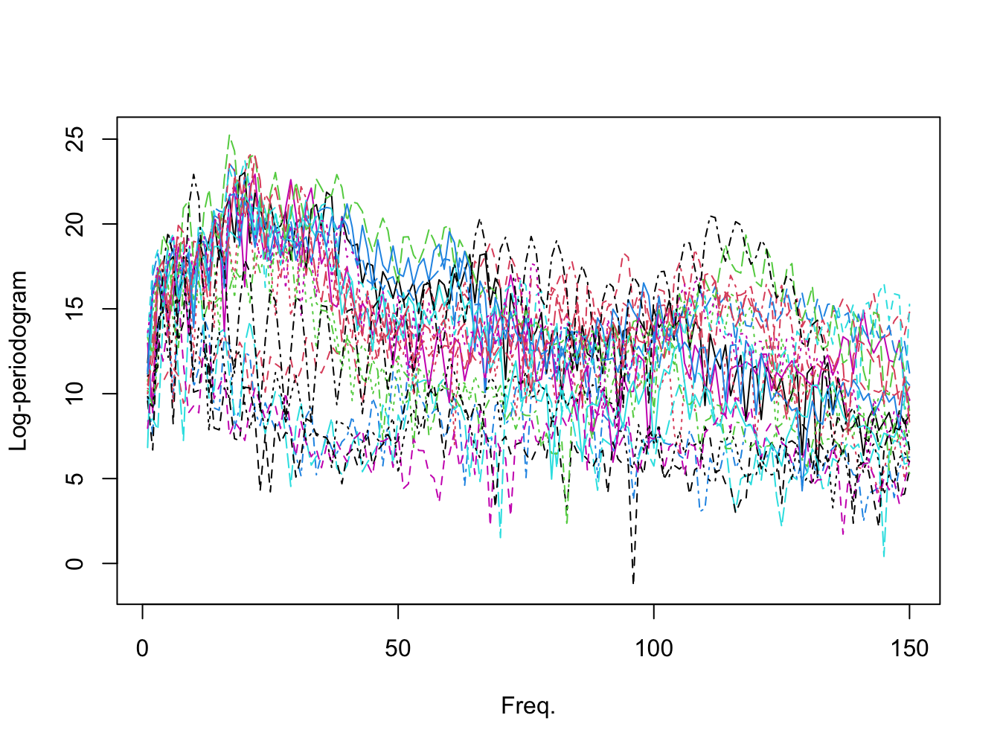
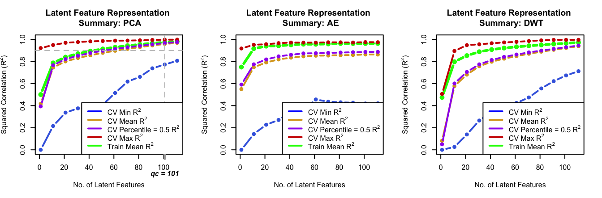

<!-- README.md is generated from README.Rmd. Please edit that file -->

# GLarE


<!-- badges: start -->
<!-- badges: end -->

The goal of GLaRE is to …

## Installation

You can install the development version of GLarE from
[GitHub](https://github.com/) with:

``` r
# install.packages("devtools")
devtools::install_github("edwardgunning/GLaRe")
```

## Example

Load the `GLaRE` package.

``` r
library(GLarE)
```

We use the Phenoeme dataset for this example (see
[here](https://www.math.univ-toulouse.fr/~ferraty/SOFTWARES/NPFDA/)).

``` r
# Phoenome dataset:
PH <- readr::read_table(file = "https://www.math.univ-toulouse.fr/~ferraty/SOFTWARES/NPFDA/npfda-phoneme.dat", col_names = FALSE)
PH <- as.matrix(PH)[, 1:150]
par(mfrow = c(1, 1))
matplot(t(PH)[, sample(1:nrow(PH), size = 20)], type = "l", xlab = "Freq.", ylab = "Log-periodogram")
```



We look at the representation given by PCA (left) and autoencoder
(right)

``` r
# run GLaRe
par(mfrow = c(1, 2), cex = 0.75) # side-by-side plots

## PCA:
test_glare <- GLaRe(
  mat = PH,
  learn = "pca",
  kf = 5,
  sqcorrel = c("trainmean", "cvmean", "cvmin", "cvmax"),
  cvqlines = 0.5,
  cutoffcriterion = 0.5,
  cutoffvalue = 0.9,
  incr = 8,
  lim = 80,
  verbose = FALSE)

## autoencoder
test_glare <- GLaRe(
  mat = PH,
  learn = "autoencoder",
  kf = 5,
  sqcorrel = c("trainmean", "cvmean", "cvmin", "cvmax"),
  cvqlines = 0.5,
  cutoffcriterion = 0.5,
  cutoffvalue = 0.9,
  incr = 8,
  lim = 80,
  ae_args = list(link_fun = "linear", epoch = 50),
  verbose = FALSE)
#> Warning in GLaRe(mat = PH, learn = "autoencoder", kf = 5, sqcorrel =
#> c("trainmean", : No qualifying criterion found, try adjusting parameters.
```


