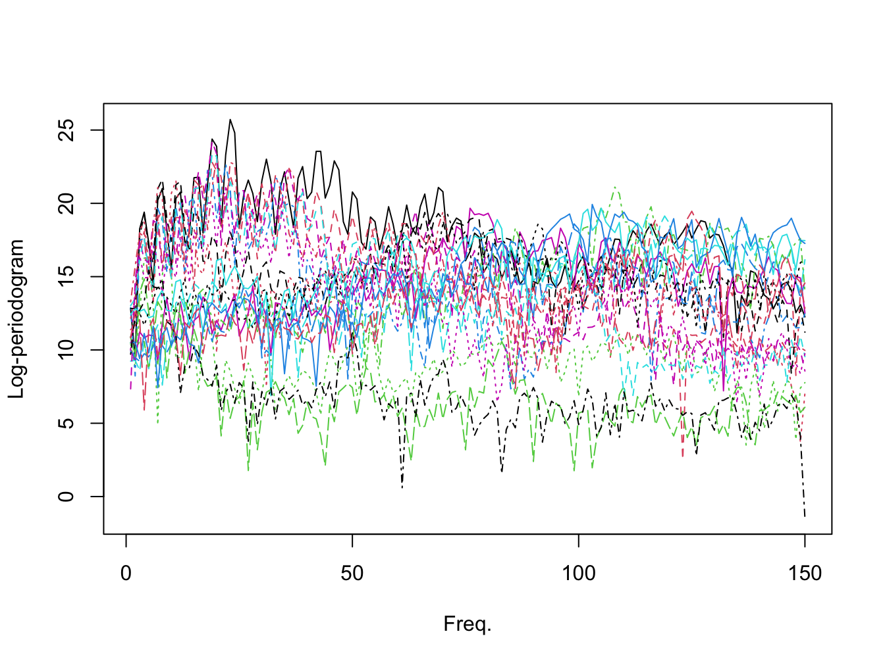

<!-- README.md is generated from README.Rmd. Please edit that file -->

# GLarE

<!-- badges: start -->
<!-- badges: end -->

The goal of GLaRE is to …

## Installation

You can install the development version of GLarE from
[GitHub](https://github.com/) with:

``` r
# install.packages("devtools")
devtools::install_github("edwardgunning/GLaRe")
```

## Example

Load the `GLaRE` package.

``` r
library(GLarE)
```

We use the Phenoeme dataset for this example (see
[here](https://www.math.univ-toulouse.fr/~ferraty/SOFTWARES/NPFDA/)).

``` r
# Phoenome dataset:
PH <- readr::read_table(file = "https://www.math.univ-toulouse.fr/~ferraty/SOFTWARES/NPFDA/npfda-phoneme.dat", col_names = FALSE)
#> 
#> ── Column specification ────────────────────────────────────────────────────────
#> cols(
#>   .default = col_double()
#> )
#> ℹ Use `spec()` for the full column specifications.
```

``` r
PH <- as.matrix(PH)[, 1:150]
par(mfrow = c(1, 1))
matplot(t(PH)[, sample(1:nrow(PH), size = 20)], type = "l", xlab = "Freq.", ylab = "Log-periodogram")
```



We look at the representation given by PCA (left) and autoencoder
(right)

``` r
# run GLaRe
par(mfrow = c(1, 2)) # side-by-side plots

## PCA:
test_glare <- GLaRe(
  mat = PH,
  learn = "pca",
  kf = 5,
  sqcorrel = c("trainmean", "cvmean", "cvmin", "cvmax"),
  cvqlines = 0.5,
  cutoffcriterion = 0.5,
  cutoffvalue = 0.9,
  incr = 5,
  lim = 50)
#> [1] "====== Training ======"
#> [1] "= Latent Dim. = 1"
#> [1] "= Latent Dim. = 6"
#> [1] "= Latent Dim. = 11"
#> [1] "= Latent Dim. = 16"
#> [1] "= Latent Dim. = 21"
#> [1] "= Latent Dim. = 26"
#> [1] "= Latent Dim. = 31"
#> [1] "= Latent Dim. = 36"
#> [1] "= Latent Dim. = 41"
#> [1] "= Latent Dim. = 46"
#> [1] "====== Performing 5-fold CV ======="
#> [1] "==== Fold  1 ===="
#> [1] "= Latent Dim. = 1"
#> [1] "= Latent Dim. = 6"
#> [1] "= Latent Dim. = 11"
#> [1] "= Latent Dim. = 16"
#> [1] "= Latent Dim. = 21"
#> [1] "= Latent Dim. = 26"
#> [1] "= Latent Dim. = 31"
#> [1] "= Latent Dim. = 36"
#> [1] "= Latent Dim. = 41"
#> [1] "= Latent Dim. = 46"
#> [1] "==== Fold  2 ===="
#> [1] "= Latent Dim. = 1"
#> [1] "= Latent Dim. = 6"
#> [1] "= Latent Dim. = 11"
#> [1] "= Latent Dim. = 16"
#> [1] "= Latent Dim. = 21"
#> [1] "= Latent Dim. = 26"
#> [1] "= Latent Dim. = 31"
#> [1] "= Latent Dim. = 36"
#> [1] "= Latent Dim. = 41"
#> [1] "= Latent Dim. = 46"
#> [1] "==== Fold  3 ===="
#> [1] "= Latent Dim. = 1"
#> [1] "= Latent Dim. = 6"
#> [1] "= Latent Dim. = 11"
#> [1] "= Latent Dim. = 16"
#> [1] "= Latent Dim. = 21"
#> [1] "= Latent Dim. = 26"
#> [1] "= Latent Dim. = 31"
#> [1] "= Latent Dim. = 36"
#> [1] "= Latent Dim. = 41"
#> [1] "= Latent Dim. = 46"
#> [1] "==== Fold  4 ===="
#> [1] "= Latent Dim. = 1"
#> [1] "= Latent Dim. = 6"
#> [1] "= Latent Dim. = 11"
#> [1] "= Latent Dim. = 16"
#> [1] "= Latent Dim. = 21"
#> [1] "= Latent Dim. = 26"
#> [1] "= Latent Dim. = 31"
#> [1] "= Latent Dim. = 36"
#> [1] "= Latent Dim. = 41"
#> [1] "= Latent Dim. = 46"
#> [1] "==== Fold  5 ===="
#> [1] "= Latent Dim. = 1"
#> [1] "= Latent Dim. = 6"
#> [1] "= Latent Dim. = 11"
#> [1] "= Latent Dim. = 16"
#> [1] "= Latent Dim. = 21"
#> [1] "= Latent Dim. = 26"
#> [1] "= Latent Dim. = 31"
#> [1] "= Latent Dim. = 36"
#> [1] "= Latent Dim. = 41"
#> [1] "= Latent Dim. = 46"
#> Warning in GLaRe(mat = PH, learn = "pca", kf = 5, sqcorrel = c("trainmean", :
#> No qualifying criterion found, try adjusting parameters.
```

``` r

## autoencoder
test_glare <- GLaRe(
  mat = PH,
  learn = "autoencoder",
  kf = 5,
  sqcorrel = c("trainmean", "cvmean", "cvmin", "cvmax"),
  cvqlines = 0.5,
  cutoffcriterion = 0.5,
  cutoffvalue = 0.9,
  incr = 5,
  lim = 50,
  ae_args = list(link_fun = "linear", epoch = 50))
#> [1] "====== Training ======"
#> [1] "= Latent Dim. = 1"
#> [1] "= Latent Dim. = 2"
#> [1] "= Latent Dim. = 3"
#> [1] "= Latent Dim. = 4"
#> [1] "= Latent Dim. = 5"
#> [1] "= Latent Dim. = 6"
#> [1] "= Latent Dim. = 7"
#> [1] "= Latent Dim. = 8"
#> [1] "= Latent Dim. = 9"
#> [1] "= Latent Dim. = 10"
#> [1] "====== Performing 5-fold CV ======="
#> [1] "==== Fold  1 ===="
#> [1] "= Latent Dim. = 1"
#> [1] "= Latent Dim. = 2"
#> [1] "= Latent Dim. = 3"
#> [1] "= Latent Dim. = 4"
#> [1] "= Latent Dim. = 5"
#> [1] "= Latent Dim. = 6"
#> [1] "= Latent Dim. = 7"
#> [1] "= Latent Dim. = 8"
#> [1] "= Latent Dim. = 9"
#> [1] "= Latent Dim. = 10"
#> [1] "==== Fold  2 ===="
#> [1] "= Latent Dim. = 1"
#> [1] "= Latent Dim. = 2"
#> [1] "= Latent Dim. = 3"
#> [1] "= Latent Dim. = 4"
#> [1] "= Latent Dim. = 5"
#> [1] "= Latent Dim. = 6"
#> [1] "= Latent Dim. = 7"
#> [1] "= Latent Dim. = 8"
#> [1] "= Latent Dim. = 9"
#> [1] "= Latent Dim. = 10"
#> [1] "==== Fold  3 ===="
#> [1] "= Latent Dim. = 1"
#> [1] "= Latent Dim. = 2"
#> [1] "= Latent Dim. = 3"
#> [1] "= Latent Dim. = 4"
#> [1] "= Latent Dim. = 5"
#> [1] "= Latent Dim. = 6"
#> [1] "= Latent Dim. = 7"
#> [1] "= Latent Dim. = 8"
#> [1] "= Latent Dim. = 9"
#> [1] "= Latent Dim. = 10"
#> [1] "==== Fold  4 ===="
#> [1] "= Latent Dim. = 1"
#> [1] "= Latent Dim. = 2"
#> [1] "= Latent Dim. = 3"
#> [1] "= Latent Dim. = 4"
#> [1] "= Latent Dim. = 5"
#> [1] "= Latent Dim. = 6"
#> [1] "= Latent Dim. = 7"
#> [1] "= Latent Dim. = 8"
#> [1] "= Latent Dim. = 9"
#> [1] "= Latent Dim. = 10"
#> [1] "==== Fold  5 ===="
#> [1] "= Latent Dim. = 1"
#> [1] "= Latent Dim. = 2"
#> [1] "= Latent Dim. = 3"
#> [1] "= Latent Dim. = 4"
#> [1] "= Latent Dim. = 5"
#> [1] "= Latent Dim. = 6"
#> [1] "= Latent Dim. = 7"
#> [1] "= Latent Dim. = 8"
#> [1] "= Latent Dim. = 9"
#> [1] "= Latent Dim. = 10"
#> Warning in GLaRe(mat = PH, learn = "autoencoder", kf = 5, sqcorrel =
#> c("trainmean", : No qualifying criterion found, try adjusting parameters.
```


